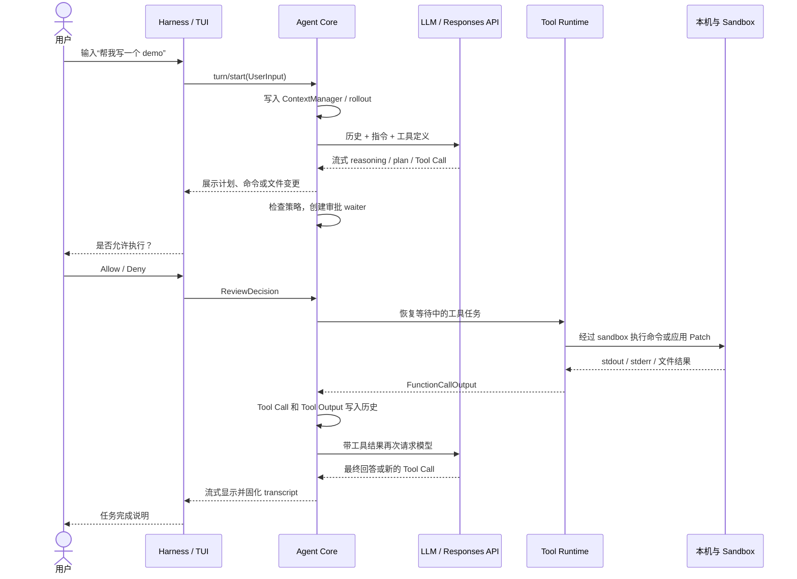
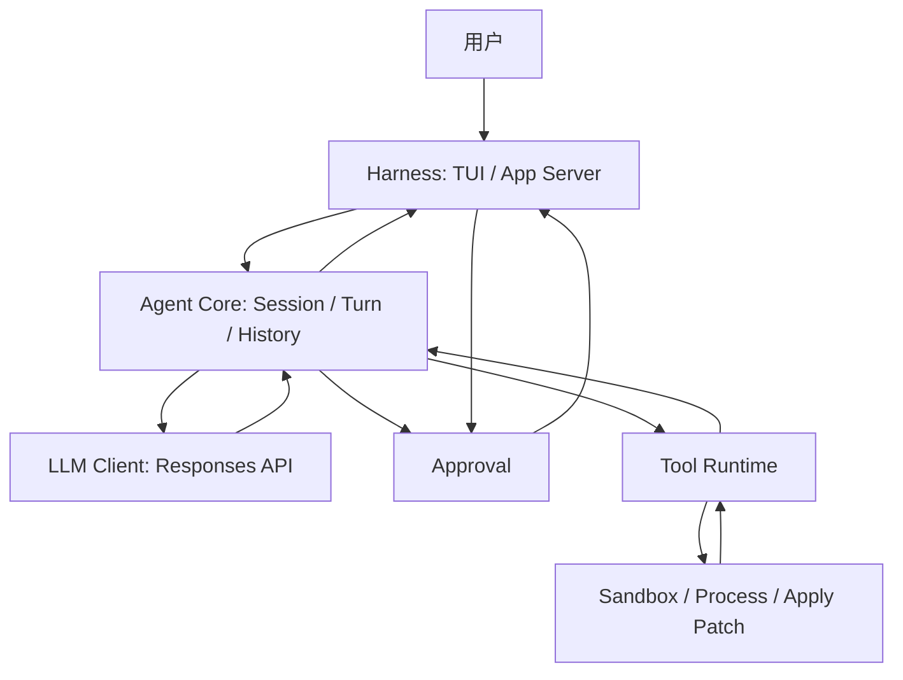
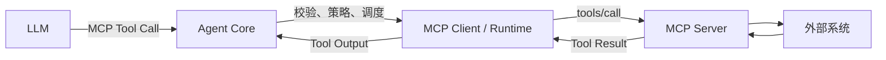

# Agent 三层架构：从 HelloAgent 理论到 Codex 源码与 Rust 演示

> 本文基于 HelloAgent 理论、Codex 源码和本仓库的 Rust Demo。

## 1. 先用一句话理解三层

| 层 | 说人话 | 在 Codex 中用户能看到什么 |
|---|---|---|
| LLM | 根据当前上下文决定“回答用户”还是“请求某个工具” | 流式出现的解释、计划、最终回答，以及模型提出的命令或文件操作 |
| Agent Core | 负责记账和调度：保存历史、调用模型、识别工具、等待审批、执行后继续问模型 | Codex 为什么能连续完成“看代码 → 改文件 → 跑命令 → 根据报错再修改” |
| Harness | 把 Agent 放进真实程序和电脑环境：接收输入、显示过程、弹审批框、装配工具和工作目录 | CLI/TUI 输入框、计划区、命令输出、Diff、Allow/Deny 选择和最终 transcript |

最重要的边界是：

- LLM **提出动作**，但不直接操作电脑。
- Agent Core **决定流程如何继续**，但不负责画界面。
- Harness **承载交互和运行环境**，但不替模型思考。
- 用户点击允许后，操作仍要经过工具运行时、策略和 sandbox，不是把模型文本直接交给系统。

---

## 2. 从 HelloAgent 理论看 LLM 和 Agent 的两种循环

HelloAgent 第三章介绍了 Token、Embedding、Transformer、自注意力、Decoder-only 和采样。可以把 LLM 的一次生成理解成：

```text
输入文本
  → 分词得到 Token
  → Transformer 根据已有 Token 计算下一个 Token 的概率
  → 采样一个 Token
  → 把新 Token 接到末尾
  → 重复，直到生成结束
```

这是 **LLM 内部的 Token 循环**。它解决的是“下一段文字是什么”。

HelloAgent 第四章的 ReAct 则是另一层循环：

```text
模型思考
  → 提出 Action
  → Agent 执行工具
  → 得到 Observation
  → 把 Observation 交回模型
  → 模型继续判断
```

这是 **Agent 外部的步骤循环**。它解决的是“下一步该做什么，以及做完后是否继续”。

两者不要混为一谈：

- LLM 可以生成 `请运行 cargo test`，但生成文字不等于真的运行了命令。
- Agent Core 必须识别这是工具请求，检查策略和审批，再调用本机工具。
- 工具输出必须重新写进上下文，模型才知道命令成功还是失败。

---

## 3. 用“帮我写一个 demo”串起 Codex 全流程

假设用户在 Codex TUI 中输入：

```text
帮我写一个 demo
```

实际过程不是“一次请求模型，然后直接返回答案”，而是下面这条链路。



按用户能观察到的现象拆开看：

1. **输入消息**：TUI 把文本整理成结构化 `UserInput`。
2. **开始 Turn**：空闲时发送 `turn/start`；任务进行中追加输入时可走 `turn/steer` 或排队。
3. **记录历史**：Core 把用户输入写入 `ContextManager`，并持久化到 rollout。
4. **请求模型**：请求中不只有一句用户消息，还包括系统指令、历史、工具定义和推理配置。
5. **流式显示**：模型输出被解析为统一事件，所以界面能逐步显示解释、计划、命令和回答。
6. **识别工具**：`ToolRouter` 判断输出是普通文本还是 Function Call / Custom Tool Call。
7. **发起审批**：需要审批时，Core 创建一个等待器并通知 Harness。
8. **显示弹窗**：TUI 的 Approval Overlay 只负责显示选项和收集决定，不负责安全判断。
9. **恢复执行**：用户决定被转换成 `ReviewDecision`，Core 找到对应等待器。
10. **本机操作**：允许后仍经过 Tool Orchestrator、执行策略和 sandbox。
11. **回填结果**：stdout、stderr、Patch 结果等被转换成 Tool Output，和原 Tool Call 通过 `call_id` 对应。
12. **继续思考**：Core 再次请求模型。模型看到真实执行结果后，决定继续修复还是给最终答案。

---

## 4. Codex 的 LLM 层

### 4.1 它负责什么

Codex 的 LLM 层负责：

- 把 Agent Core 准备好的历史转换成 Responses API 请求。
- 附带当前模型、系统指令、工具 schema、推理参数和输出格式。
- 通过 WebSocket 或 HTTP/SSE 与模型服务通信。
- 把流式 JSON 转成文本、推理、计划和 Tool Call 等统一事件。

它不负责：

- 直接运行 shell。
- 直接写文件。
- 决定用户是否批准。
- 保存完整的本地会话生命周期。

### 4.2 请求中究竟有什么

生产代码位于：

- `codex/codex-rs/core/src/client.rs`
- `codex/codex-rs/codex-api/src/endpoint/responses.rs`

`ModelClient::build_responses_request` 构造的请求包含：

```rust
let request = ResponsesApiRequest {
    model: model_info.slug.clone(),
    instructions,
    input,
    tools,
    tool_choice: "auto".to_string(),
    parallel_tool_calls: prompt.parallel_tool_calls
        && !model_info.use_responses_lite,
    reasoning: Some(reasoning),
    store: false,
    stream: true,
    // ...
};
```

说人话就是：Codex 不是只把“帮我写一个 demo”发给模型，而是告诉模型：

- 你现在扮演什么角色。
- 前面发生过什么。
- 你能使用哪些工具。
- 你可以自己判断现在回答还是调用工具。
- 请把结果流式返回。

几个关键字段：

- `tool_choice: "auto"`：由模型判断是否需要工具。
- `stream: true`：允许界面边接收边显示。
- `store: false`：会话历史主要由 Codex 客户端管理，而不是依赖服务端替客户端记住全部过程。

HTTP 回退会向 `/responses` 发 `POST`，并使用 `text/event-stream` 接收 SSE。对应源码不是概念代码，而是真实网络边界：

```rust
let stream_response = self
    .session
    .stream_encoded_json_with(
        Method::POST,
        "/responses",
        extra_headers,
        Some(body),
        |req| {
            req.headers.insert(
                http::header::ACCEPT,
                HeaderValue::from_static("text/event-stream"),
            );
            req.compression = request_compression;
        },
    )
    .await?;
```

来源：`codex-rs/codex-api/src/endpoint/responses.rs:135-150`。

这段代码完成了 LLM 层的三个实际动作：

1. 把 `ResponsesApiRequest` 编码成 HTTP Body。
2. 发送 `POST /responses`。
3. 用 `Accept: text/event-stream` 告诉服务端按流式事件返回。

Codex 也支持优先使用 Responses WebSocket；HTTP/SSE 是其中一条真实传输路径。无论底层使用哪种传输，Agent Core 最后收到的都是统一 `ResponseEvent`，因此上层不需要关心每个网络数据包怎么到达。

### 4.3 流式结果如何进入 Core

`codex/codex-rs/codex-api/src/sse/responses.rs` 会把 SSE 数据解析成 `ResponsesStreamEvent`。当收到 `response.output_item.done` 时，再转换为统一的 `ResponseItem`：

```rust
pub fn process_responses_event(
    event: ResponsesStreamEvent,
) -> Result<Option<ResponseEvent>, ResponsesEventError> {
    match event.kind.as_str() {
        "response.output_item.done" => {
            if let Some(item_val) = event.item {
                if let Ok(item) = serde_json::from_value::<ResponseItem>(item_val) {
                    return Ok(Some(ResponseEvent::OutputItemDone(item)));
                }
            }
        }
        "response.output_text.delta" => {
            if let Some(delta) = event.delta {
                return Ok(Some(ResponseEvent::OutputTextDelta(delta)));
            }
        }
        "response.custom_tool_call_input.delta" => {
            if let (Some(delta), Some(item_id)) =
                (event.delta, event.item_id.clone().or(event.call_id.clone()))
            {
                return Ok(Some(ResponseEvent::ToolCallInputDelta {
                    item_id,
                    call_id: event.call_id,
                    delta,
                }));
            }
        }
        // reasoning delta、完成和错误事件省略
        _ => {}
    }
    Ok(None)
}
```

来源：`codex-rs/codex-api/src/sse/responses.rs:353-407`。

这段 `match` 就是 LLM 层的“翻译器”：

- `output_text.delta` 被翻译为逐字显示的回答。
- `reasoning_summary_text.delta` 被翻译为逐步显示的推理摘要。
- `custom_tool_call_input.delta` 被翻译为工具参数流。
- `output_item.done` 表示一个完整 `ResponseItem` 已经组装好，可以交给 Agent Core 判断它究竟是普通消息还是工具调用。

因此 TUI 看到的流式文字、Core 识别的工具调用，并不是两套互不相干的系统，而是同一条模型事件流的不同消费方式。

---

## 5. Codex 的 Agent Core

### 5.1 `run_turn` 是外层大循环

核心代码位于：

- `codex/codex-rs/core/src/session/turn.rs`

源码注释已经直接描述了循环：

```rust
/// Takes initial turn input and runs a loop where, at each sampling request,
/// the model replies with either:
///
/// - requested function calls
/// - an assistant message
///
/// - If the model requests a function call, we execute it and send the output
///   back to the model in the next sampling request.
/// - If the model sends only an assistant message, we record it in the
///   conversation history and consider the turn complete.
```

翻译成人话：

- 模型要工具：先执行工具，Turn 不结束。
- 模型只给最终文字：保存回答，Turn 才结束。

每次请求模型前，Core 从统一历史构造输入：

```rust
let sampling_request_input: Vec<ResponseItem> = async {
    sess.clone_history()
        .await
        .for_prompt(&step_context.settings.model_info.input_modalities)
}
.await;
```

工具执行后，`needs_follow_up` 会让循环继续：

```rust
let needs_follow_up = model_needs_follow_up || has_pending_input;
```

这就是用户看到 Codex 连续“想一下、跑命令、看结果、再想一下”的根本原因。

### 5.2 历史不是聊天字符串拼接

主要代码位于：

- `codex/codex-rs/core/src/state/session.rs`
- `codex/codex-rs/core/src/context_manager/history.rs`
- `codex/codex-rs/core/src/context_manager/normalize.rs`
- `codex/codex-rs/core/src/session/inject.rs`

`SessionState` 持有 `ContextManager`。历史内部保存按时间排列的 `ResponseItemEnvelope`，包含：

- 用户消息。
- Assistant 消息。
- Tool Call。
- Tool Output。
- 推理和其他会话项目。

发送给模型前还会做规范化：

- 为缺少结果的 Tool Call 补结构完整的终止结果。
- 删除孤立的 Tool Output。
- 模型不支持图片或音频时移除对应内容。
- 按 Token 策略截断过大的工具输出。

所以“Codex 记得前面执行过什么”并不是模型凭空记住，而是客户端把历史重新装进下一次请求。

### 5.3 Tool Call 不会直接变成系统命令

关键代码位于：

- `codex/codex-rs/core/src/stream_events_utils.rs`
- `codex/codex-rs/core/src/tools/parallel.rs`
- `codex/codex-rs/core/src/tools/context.rs`

模型输出先交给 `ToolRouter::build_tool_call`：

```rust
match ToolRouter::build_tool_call(item.clone()) {
    Ok(Some(call)) => {
        record_completed_response_item(...).await;
        let tool_future = Box::pin(
            ctx.tool_runtime
                .clone()
                .handle_tool_call(call, cancellation_token),
        );
        output.needs_follow_up = true;
        output.tool_future = Some(tool_future);
    }
    Ok(None) => {
        // 普通 assistant message、reasoning 等
    }
    // ...
}
```

顺序非常重要：

1. 判断是不是工具调用。
2. 先把模型产生的 Tool Call 记录下来。
3. 创建工具执行任务。
4. 标记本轮之后还要继续请求模型。
5. 工具完成后生成与 `call_id` 对应的 `FunctionCallOutput`。

普通工具失败通常也会被包装成模型可见结果，而不是立刻让整个 Agent 崩溃。这样模型可以看到错误并换一种方案。

### 5.4 审批为什么能“暂停工具，等用户点按钮”

关键代码位于：

- `codex/codex-rs/core/src/tools/approvals.rs`
- `codex/codex-rs/core/src/session/mod.rs`
- `codex/codex-rs/core/src/state/turn.rs`
- `codex/codex-rs/core/src/session/handlers.rs`

Core 为审批创建一次性 channel：

```rust
let (tx_approve, rx_approve) = oneshot::channel();

ts.insert_pending_approval(
    effective_approval_id.clone(),
    tx_approve,
);

self.send_event(turn_context, event).await;
rx_approve.await.unwrap_or(ReviewDecision::Abort)
```

说人话：

- 工具任务运行到危险操作前先停住。
- Core 把一个“以后用来唤醒我的发送端”放进 pending map。
- Core 向外发送审批事件。
- 工具任务等待 receiver。
- 用户做出决定后，Core 根据审批 ID 找回 sender，把决定发进去。
- 工具任务被唤醒，继续执行或终止。

审批并不一定直接弹给用户。源码定义的优先顺序大致是：

1. Permission hooks。
2. Guardian 或严格自动审查。
3. 用户审批。

因此有些安全操作可以自动通过，有些操作才需要用户确认。

---

## 6. Codex 的 Harness

Harness 不是单一文件，而是一组把 Core 接到用户和操作系统的组件。

### 6.1 输入和可视化

主要目录：

- `codex/codex-rs/tui/src/`
- `codex/codex-rs/app-server/src/`
- `codex/codex-rs/app-server-client/src/`

用户在 Composer 中输入内容后：

- 空闲时启动新 Turn。
- Turn 运行中可以 steer 或把消息排队。
- Core 的 reasoning、plan、command、patch 和 assistant message 被转换成 TUI 可展示事件。
- 活动中的内容先显示在 active cell，完成后固化到 transcript。

这就是 Codex 看起来像在“实时工作”，而不是最后一次性吐出所有日志的原因。

### 6.2 Approval Overlay 只负责交互

`codex/codex-rs/tui/src/bottom_pane/approval_overlay.rs` 中的审批请求包括：

```rust
pub(crate) enum ApprovalRequest {
    Exec(ExecApprovalRequest),
    Permissions(PermissionsApprovalRequest),
    ApplyPatch(ApplyPatchApprovalRequest),
    McpElicitation(McpElicitationApprovalRequest),
}
```

Overlay 的职责是：

- 显示将要执行的命令或文件变更。
- 显示 Allow、Deny、会话内允许等选项。
- 把用户选择返回 App Server/Core。

它不负责判断命令本身安全不安全。安全判断属于 Core policy、Guardian、工具运行时和 sandbox。

### 6.3 App Server 是协议桥梁

`codex/codex-rs/app-server/src/bespoke_event_handling.rs` 会把 Core 事件转换成 JSON-RPC Server Request，例如：

```text
ExecApprovalRequest
  → Command execution approval request

ApplyPatchApprovalRequest
  → File change request approval
```

这里存在两个不同 ID：

- JSON-RPC Request ID：用于把界面响应和协议请求对应起来。
- Core approval/call ID：用于找到 `TurnState.pending_approvals` 中真正等待的工具。

用户点击后，App Server 把响应转换成 `ReviewDecision`，再提交 `Op::ExecApproval` 或 `Op::PatchApproval`。

### 6.4 允许后如何真正操作本机

命令最终会进入类似下面的边界：

```rust
codex_sandboxing::spawn_process(
    codex_sandboxing::SpawnRequest {
        command: &request.command,
        cwd: native_cwd.as_path(),
        env: &request.env,
        sandbox: request.sandbox,
        // ...
    },
)
.await;
```

文件 Patch 最终走：

```rust
codex_apply_patch::apply_patch_with_options(...)
```

所以完整关系是：

```text
模型提出命令
  → Core 识别工具
  → 策略检查
  → 必要时用户审批
  → Tool Orchestrator
  → sandbox
  → 创建本机进程或应用 Patch
```

“用户允许”只是授权信号，不是取消所有安全边界。

---

## 7. 三层如何映射到 Codex 源码

| 三层 | Codex 主要源码 | 核心职责 |
|---|---|---|
| LLM | `core/src/client.rs`、`codex-api/src/endpoint/responses.rs`、`codex-api/src/sse/responses.rs` | 构造 Responses API 请求，流式接收并解析模型事件 |
| Agent Core | `core/src/session/turn.rs`、`context_manager/`、`stream_events_utils.rs`、`tools/` | Turn 循环、历史、Tool Call、审批、工具结果回填、继续或结束 |
| Harness | `tui/`、`app-server/`、`app-server-client/` | 输入、可视化、协议桥接、审批 UI、配置和宿主环境 |
| 本机执行边界 | `core/src/tools/`、sandboxing、apply-patch | 策略后执行命令、修改文件并收集结果 |

依赖方向可以简化为：



---

## 8. 本仓库 Rust Demo

Demo 位于：

```text
helloagent/rust-three-layer-agent
```

它不是复制 Codex，而是保留最关键的生产链路，方便单步阅读：

```text
User
  → Conversation History
  → Mock LLM
  → 结构化 ToolCall
  → Harness 审批
  → 受限工具执行
  → ToolResult 写回历史
  → 再次请求 Mock LLM
  → FinalAnswer
```

### 8.1 文件分工

| 文件 | 所属层 | 作用 |
|---|---|---|
| `src/llm.rs` | LLM | 定义 `ConversationItem`、`ToolCall`、`ModelOutput` 和离线 `MockLlm` |
| `src/agent_core.rs` | Agent Core | 保存历史，执行多轮循环，调度工具和审批 |
| `src/tools.rs` | 工具/宿主边界 | 在受限工作目录写文件、执行允许列表中的 `rustc` |
| `src/main.rs` | Harness | 读取参数、组装组件、显示审批、打印结果和历史 |

### 8.2 为什么不用旧版 `Action: calculator[...]`

旧 Demo 依靠字符串解析：

```text
Action: calculator[15 * 8 + 32]
```

新版改成 Rust 枚举和结构体：

```rust
pub enum ModelOutput {
    ToolCall {
        reasoning: String,
        call: ToolCall,
    },
    FinalAnswer {
        reasoning: String,
        answer: String,
    },
}
```

这更接近 Codex 的 `ResponseItem`：模型输出是什么类型，由结构本身表达，不需要到处切字符串。

### 8.3 历史如何工作

Demo 使用统一的 `ConversationItem`：

```rust
pub enum ConversationItem {
    User(String),
    ToolCall(ToolCall),
    ToolResult {
        call_id: String,
        success: bool,
        output: String,
    },
    Assistant(String),
}
```

第一次请求前只有：

```text
User: 帮我写一个可以运行的 Rust demo
```

写文件后变成：

```text
User
ToolCall(write-1, write_file)
ToolResult(write-1, success=true, 已写入 ...)
```

运行命令后再增加：

```text
ToolCall(run-1, run_command)
ToolResult(run-1, success=true, Hello from ...)
```

模型第三次读取历史，看到任务已经真实运行成功，才返回最终答案。

### 8.4 审批拒绝也要写回历史

Agent Core 中，无论工具成功、失败还是用户拒绝，都会生成 `ToolResult`：

```rust
let result = if tool.requires_approval()
    && !approval.approve(&call.name, &tool.approval_summary(&call.arguments))
{
    Err("用户拒绝执行该操作".to_string())
} else {
    tool.run(&self.workspace, &call.arguments)
};
```

如果用户拒绝写文件，Mock LLM 下一轮会看到失败结果并回答“没有创建 Demo”，而不是假装已经完成。这正是 Agent 可靠性的关键。

### 8.5 Demo 的安全边界

Demo 有意保留两个简单边界：

- 文件只能使用普通相对路径，不能写绝对路径或 `..`。
- 命令工具只允许 `rustc`，参数不能包含目录跳转。

这不是完整 sandbox，但表达了与 Codex 相同的原则：

```text
批准 ≠ 裸执行
批准之后仍要经过工具自己的安全限制
```

### 8.6 运行方式

交互审批：

```powershell
cargo run
```

自动批准，方便观察完整流程：

```powershell
cargo run -- --yes
```

指定任务文字：

```powershell
cargo run -- --yes 帮我写一个 demo
```

生成文件会放到：

```text
helloagent/rust-three-layer-agent/demo-workspace
```

一次成功运行会经历三次模型调用：

```text
第 1 次：请求 write_file
第 2 次：看到写入成功，请求 run_command
第 3 次：看到运行输出，返回最终答案
```

---

## 9. Tool、MCP 与 A2A 放在三层架构的什么位置

### 9.1 Tool 的控制权属于 Agent Core

一次工具调用实际分成四段：

```text
LLM：提出结构化 Tool Call
  → Agent Core：识别、校验、审批和调度
  → Tool Runtime：准备参数并调用具体实现
  → Sandbox / 本机 / 外部服务：产生真实结果
```

因此不能说“模型直接调用了工具”。模型只产生调用意图；真正掌握执行权的是 Agent Core，实际副作用发生在 Tool Runtime 之后。

在 Codex 中，`ToolRouter::build_tool_call` 先把 `ResponseItem` 识别成内部 Tool Call，随后 `handle_tool_call` 才创建执行任务。工具完成后，结果被包装成带同一 `call_id` 的 `FunctionCallOutput`，写回历史后再请求模型。对应实现主要在 `codex/codex-rs/core/src/tools/router.rs`、`codex/codex-rs/core/src/tools/parallel.rs` 和 `codex/codex-rs/core/src/tools/registry.rs`。对应实现主要在 `codex/codex-rs/core/src/tools/router.rs`、`codex/codex-rs/core/src/tools/parallel.rs` 和 `codex/codex-rs/core/src/tools/registry.rs`。

### 9.2 MCP：把外部工具接入 Tool Runtime

MCP 解决的是：**Agent 如何使用统一协议发现和调用外部工具、资源或服务**。



职责边界：

- Agent Core：把 MCP 工具定义提供给模型，识别调用，做权限与生命周期编排，将结果写回历史。
- MCP Client/Runtime：负责连接 MCP Server、发送协议请求和接收结果。
- Harness：展示 MCP 调用、elicitation 或审批交互。
- MCP Server：访问真正的数据库、浏览器、企业服务或其他外部能力。

Codex TUI 的审批请求中存在 `McpElicitation`，说明 MCP Server 可以在执行过程中请求用户补充输入。它仍然要经过 Core 和 Harness 的事件链路，而不是绕过 Agent Core 直接弹 UI。

### 9.3 A2A：Agent 与 Agent 之间的任务协作

A2A 通常解决“把任务委派给另一个 Agent，并跟踪任务状态和产物”的问题：

```text
MCP：Agent 使用一个工具
A2A：Agent 把任务交给另一个 Agent
```

如果系统接入 A2A，合理的分层是：

- Agent Core：决定是否委派、创建任务、记录远端任务 ID、吸收结果并继续当前 Turn。
- A2A Client/Runtime：负责能力发现、协议传输、状态订阅和产物下载。
- Harness：显示被委派的 Agent、进度、权限请求和最终产物。

需要特别说明：当前源码分析只确认了 Codex 的子任务、父子线程和特定协作路径，**没有验证 Codex 存在通用 A2A 协议实现**。因此，A2A 在本文中只是端侧 Agent 的扩展架构位置，不能把 Codex 的内部多任务机制直接等同于标准化 Agent-to-Agent 协议。

### 9.4 三者的关系

| 概念 | 面向对象 | Core 负责什么 | Runtime 负责什么 |
|---|---|---|---|
| 本地 Tool | 文件、命令、Patch | 路由、审批、状态和结果回填 | 调用本机实现 |
| MCP | 外部工具、资源、服务 | 暴露工具、策略和会话编排 | MCP 协议通信 |
| A2A | 另一个 Agent | 任务委派、状态合并和继续决策 | Agent 间协议通信 |

---

## 10. 除上下文、Tool、MCP、A2A、Harness 外，Codex 还有哪些关键概念

HelloAgent 给出了 LLM、ReAct、Tool、Memory、`max_steps` 和框架分层等基础理论；Codex 将这些概念扩展成了生产级状态机。

### 10.1 Session、Turn、Step：三种不同粒度

| 粒度 | 说人话 | 典型内容 |
|---|---|---|
| Session | 一条长期会话线程 | 历史、配置、rollout、当前活动任务 |
| Turn | 用户一次任务从开始到最终回答 | 多次模型调用、多个工具、审批和 steer |
| Step | Turn 中的一次模型采样 | 固定的模型配置、环境快照和工具集合 |

关键源码：

- `codex/codex-rs/core/src/session/session.rs`：Session 本体和活动任务状态。
- `codex/codex-rs/core/src/session/turn.rs`：`run_turn` 主循环。
- `codex/codex-rs/core/src/session/turn_input.rs`：启动新 Turn 或将输入 steer 到活动 Turn。
- `codex/codex-rs/core/src/session/turn_context.rs`：一次 Turn 的运行上下文。
- `codex/codex-rs/core/src/session/step_context.rs`：单次模型采样的一致性边界。
- `codex/codex-rs/core/src/session/step_settings.rs`：Step 使用的设置快照。
- `codex/codex-rs/core/src/tasks/regular.rs`：Regular Turn 任务实现。

`StepContext` 是一个很重要的新概念：一次模型请求开始后，所使用的模型、环境和工具设置应保持一致；中途修改配置只影响后续 Step，不能反过来改变已经发出的请求。

这比 HelloAgent 教学代码中的单层 `for step in range(max_steps)` 更精细：`max_steps` 仍然有用，但生产系统还需要明确会话生命周期和每次采样的一致性边界。

### 10.2 Event Stream：Core 不直接操纵界面

Codex 将 reasoning、计划、命令输出、Patch、审批和 Turn 完成等状态转换成 `EventMsg`。Harness 订阅事件并决定如何显示。事件与持久化边界可从 `codex/codex-rs/core/src/protocol.rs`、`codex/codex-rs/core/src/rollout.rs` 和 `codex/codex-rs/core/src/session/rollout_reconstruction.rs` 观察：协议事件用于实时通知，rollout 则保留可重建的持久化记录。事件与持久化边界可从 `codex/codex-rs/core/src/protocol.rs`、`codex/codex-rs/core/src/rollout.rs` 和 `codex/codex-rs/core/src/session/rollout_reconstruction.rs` 观察：协议事件用于实时通知，rollout 则保留可重建的持久化记录。

```text
Core 内部状态变化
  → EventMsg
  → rollout / trace
  → App Server 或 TUI
  → 用户看到 active cell、审批框和 transcript
```

这对应 HelloAgent 的“模块化”和“依赖注入”：Agent Core 只依赖事件出口，不依赖具体终端 UI。换成 IDE、桌面客户端或远程 App Server 时，Core 主循环不必重写。

### 10.3 Rollout：可恢复、可回放的运行轨迹

Codex 通过 `codex/codex-rs/core/src/rollout.rs` 使用 `RolloutRecorder`，再由 `codex/codex-rs/core/src/session/rollout_reconstruction.rs` 从 `RolloutItem` 重建历史、Turn 设置和 compaction 状态。rollout 通常以 JSONL 轨迹保存关键会话项和事件，用于：

- Session 恢复。
- 历史重建。
- 调试和审计。
- token usage 恢复。
- compaction checkpoint。
- thread revert 后重新加载。

生产级 Agent 的“记忆”不只是 Prompt 里的文本，还包括一份可重建状态机的事件日志。Core 只重导出 `codex_rollout` crate 的 recorder；本文不对未在本次源码核对中展开的 writer 内部实现作额外推断。

### 10.4 Approval Waiter：异步暂停与恢复

审批不是同步弹窗函数，而是活动 Turn 内保存的 `oneshot::Sender<ReviewDecision>`：

```rust
let (tx_approve, rx_approve) = oneshot::channel();
turn_state.insert_pending_approval(approval_id, tx_approve);
send_approval_event().await;
let decision = rx_approve.await.unwrap_or(ReviewDecision::Abort);
```

这使 Tool Task 可以暂停，而 Session、TUI 和协议层仍可继续处理事件。用户返回决定后，Core 按审批 ID 精确恢复对应任务。入口和 waiter 编排见 `codex/codex-rs/core/src/tools/approvals.rs`、`codex/codex-rs/core/src/state/turn.rs` 与 `codex/codex-rs/core/src/session/handlers.rs`。

### 10.5 Policy、Hooks 与 Guardian：审批之前还有自动审查

Codex 的审批优先级不是“所有危险操作都直接问用户”，而是：

```text
Permission Hooks
  → Strict Auto Review / Guardian
  → 用户审批
```

对应源码集中在 `codex/codex-rs/core/src/tools/approvals.rs`、`codex/codex-rs/core/src/hook_runtime.rs`、`codex/codex-rs/core/src/exec_policy/` 和 `codex/codex-rs/core/src/guardian/`。这对应 HelloAgent 中“工具执行前需要校验”的思想，但增加了生产级策略层：

- Hook 可以基于企业规则直接允许或拒绝。
- Guardian 可以进行自动风险审查。
- 只有无法自动决定时才打断用户。

### 10.6 Sandbox 与 Escalation：批准不等于裸执行

Tool Orchestrator 的顺序可以概括为：

```text
审批
  → 选择 sandbox
  → 首次受限执行
  → 如果被 sandbox 拒绝，判断是否允许升级
  → 必要时再次审批
  → 使用升级策略重试
```

这条主链路由 `codex/codex-rs/core/src/tools/orchestrator.rs` 集中编排，并依赖 `codex/codex-rs/core/src/tools/sandboxing.rs` 和具体执行 runtime。它比 Demo 的路径检查和 `rustc` 允许列表更完整，但原则相同：模型意图、用户授权和操作系统能力是三件不同的事。

### 10.7 Compaction：上下文太长时压缩，而不是直接遗忘

HelloAgent 强调上下文窗口有限；Codex 为此加入自动和手动 compaction：

- 保留用户目标和关键历史。
- 压缩较旧的对话与工具输出。
- 安装压缩后的新历史。
- 重新计算 token usage。
- 保存 checkpoint，支持恢复。

Compaction 不是长期记忆，也不是简单截断。它是“在有限上下文窗口中保留任务连续性”的运行机制。核心实现见 `codex/codex-rs/core/src/compact.rs`、`codex/codex-rs/core/src/compact_remote_v2.rs`、`codex/codex-rs/core/src/tasks/compact.rs` 和 `codex/codex-rs/core/src/context_manager/history.rs`。

### 10.8 Resume、Revert 与取消

这些概念容易混淆：

- Resume：从 rollout 恢复 Session、历史、设置和 token 状态。
- Revert：替换线程的有效历史前缀；Codex 的新 `thread/revert` 不会自动回滚本机文件修改。
- Cancel/Interrupt：停止当前活动 Turn。
- Suspension：为跨 worker 恢复而挂起任务，不写普通终止事件。

端侧 Agent 如果只保存聊天文本，崩溃后很难知道工具是否已经执行、审批是否仍有效、当前工作区处于什么状态。恢复重建见 `codex/codex-rs/core/src/session/rollout_reconstruction.rs`，线程接口和挂起语义见 `codex/codex-rs/core/src/codex_thread.rs`，revert 后的 rollout 截断见 `codex/codex-rs/core/src/thread_rollout_truncation.rs`。Codex 的做法提醒我们：恢复必须同时考虑历史、运行状态和外部副作用。

### 10.9 Steer 与 Queued Input

用户不必等当前 Turn 完全结束后才能补充要求。Codex 可以：

- 将新输入 steer 到当前 Regular Turn。
- 把输入排队，在合适的 Step 边界吸收。
- 拒绝不适合当前状态的输入。

因此 Agent 不是一个完全封闭的长函数，而是可被用户实时干预的状态机。入口见 `codex/codex-rs/core/src/session/turn_input.rs` 的 `start_or_steer`，Session 侧处理见 `codex/codex-rs/core/src/session/session.rs`。

### 10.10 并行 Tool Call

模型可以请求并行工具。`codex/codex-rs/core/src/tools/parallel.rs` 根据工具能力调度调用，并把同一个 cancellation token 传给工具 runtime；多个工具可以并发推进，但结果仍需稳定地写回当前 Step。

适合并行：

- 多个只读搜索。
- 互不依赖的文件读取。
- 独立静态分析。

不适合盲目并行：

- 同时修改相同文件。
- 修改尚未完成时启动测试。
- 有明确前后依赖的命令。

### 10.11 Retry、Transport Fallback 与 Cancellation

真实模型调用可能断线、超时或达到上下文限制。Codex 不只是简单重发：

- 重试时可从当前 Session history 重建 Prompt。
- WebSocket 失败后可以回退到 HTTP/SSE。
- `ContextWindowExceeded`、`UsageLimitReached` 等错误有独立处理。
- 模型采样和工具任务都携带 cancellation token。

重试与退避见 `codex/codex-rs/core/src/responses_retry.rs`，传输回退见 `codex/codex-rs/core/src/client.rs`，Turn/工具取消令牌贯穿 `codex/codex-rs/core/src/tasks/`、`codex/codex-rs/core/src/session/turn.rs` 和 `codex/codex-rs/core/src/tools/parallel.rs`。这对应 HelloAgent 的错误处理理论，但生产系统必须区分“可重试网络错误”“需要 compaction 的上下文错误”“用户取消”和“权限拒绝”。

### 10.12 Token Usage、预算与终止条件

HelloAgent 使用 `max_steps` 防止无限循环。Codex 进一步记录 token usage、上下文窗口比例、工具数量和 Turn 状态。相关实现见 `codex/codex-rs/core/src/session/token_budget.rs`、`codex/codex-rs/core/src/rollout_budget.rs`、`codex/codex-rs/core/src/codex_thread.rs` 和 `codex/codex-rs/app-server/src/request_processors/token_usage_replay.rs`。

端侧 Agent 应采用联合预算：

```text
max_steps
+ max_total_tokens
+ max_wall_time
+ max_tool_calls
+ max_write_operations
+ max_consecutive_failures
+ max_observation_bytes
```

### 10.13 模型能力协商

不同模型支持的能力并不相同，例如：

- 上下文窗口。
- 图片或音频输入。
- reasoning effort 和 summary。
- parallel tool calls。
- remote compaction。
- Responses Lite 或完整 Responses API。

Core 不能假设所有模型都一样，而要根据模型能力构造请求、规范化历史和启用功能。

### 10.14 Trace、Diff 与可观测性

生产 Agent 必须能回答：

- 当前是第几个 Turn/Step？
- 模型调用了什么？
- 工具为什么被批准或拒绝？
- 修改了哪些文件？
- 测试是否真的运行？
- token、耗时和错误在哪里？

因此 Codex 同时维护事件、rollout、protocol trace、token count 和 Turn diff。它们不是附属日志，而是调试、恢复、审计和评测的基础。

---

## 11. 最容易混淆的几个问题

### 11.1 是 LLM 在运行命令吗？

不是。LLM 只生成结构化 Tool Call。真正执行命令的是 Agent Core 调度的工具运行时。

### 11.2 Harness 是不是 Agent Core？

不是。Harness 负责承载和交互，Core 负责循环和状态。TUI 弹窗不等于安全策略本身。

### 11.3 模型为什么知道命令失败了？

因为 stdout、stderr 或失败信息被转换成 Tool Output，写回历史后再次发送给模型。

### 11.4 用户拒绝后为什么还要再问模型？

“拒绝”也是一个真实 Observation。模型应基于它解释未完成原因、换方案或请求其他操作。

### 11.5 Codex 的历史等于模型长期记忆吗？

不等于。当前会话主要由客户端 `ContextManager` 和 rollout 管理。跨会话长期记忆是另一类机制。

### 11.6 模型的推理过程和 Agent 的执行历史一样吗？

不一样。推理内容是模型输出的一部分；执行历史还包括用户输入、Tool Call、审批结果、Tool Output 和最终回答。

---

## 12. 总结

把 Codex 看成三层后，它并不神秘：

```text
LLM：提出下一步
Agent Core：管理整个任务循环
Harness：让循环能够和用户、本机环境真实交互
```

用户输入“帮我写一个 demo”后，真正发生的是：

```text
接收输入
→ 保存历史
→ 带工具定义请求模型
→ 模型提出文件或命令操作
→ Core 检查策略并等待审批
→ Harness 展示 Allow / Deny
→ 用户决定回到 Core
→ 工具经过 sandbox 操作本机
→ 结果写回历史
→ 再次请求模型
→ 最终回答显示给用户
```

Rust Demo 刻意复现了这条主链路。它虽然没有 Codex 完整的网络协议、并行工具、上下文压缩、Guardian 和生产级 sandbox，但已经能够清楚展示三层的职责边界，以及一个编码 Agent 为什么能够连续完成多步任务。
