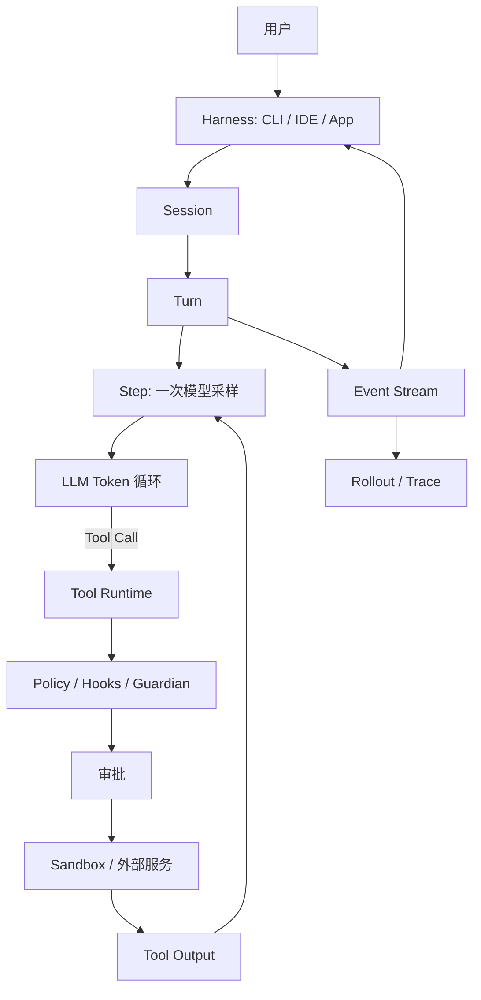
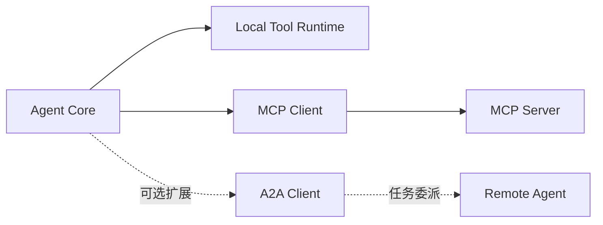
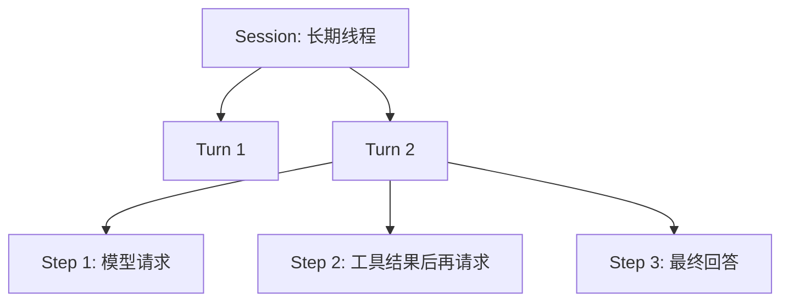

# 端侧 Agent 核心概念与 Codex、HelloAgent 启发

> 面向准备开始端侧 Agent 开发的小组。本文用 HelloAgent 理论建立共同语言，再用 Codex 工程实现说明生产系统需要补齐什么。

## 1. 核心概念地图

端侧 Agent 不是“把问题发给模型，再显示答案”，而是一套围绕模型建立的可控运行时。



- **LLM**：根据上下文生成 Token 或结构化 Tool Call。
- **Agent Core**：维护状态并驱动“模型—工具—结果—再请求模型”的循环。
- **Harness**：把 Core 接到用户、界面、本机环境和协议客户端。
- **Session**：一条可持续、可恢复的会话线程。
- **Turn**：用户一次任务从输入到最终回答的完整运行。
- **Step**：Turn 中的一次模型采样及其固定配置。
- **Event**：运行中的事实通知；**rollout** 是可持久化、可重建的运行轨迹。

理论入口：`docs/chapter3/第三章 大语言模型基础.md`、`docs/chapter4/第四章 智能体经典范式构建.md`、`docs/chapter7/第七章 构建你的Agent框架.md`。

## 2. Token 循环与 Step 循环

HelloAgent 第三章介绍 Decoder-Only 和自回归生成：

```text
已有上下文 → 预测下一个 Token → 采样 → 追加到序列 → 重复直到停止
```

这是模型内部的 Token 循环，只解决“接下来生成什么”。即使模型输出“运行测试”，电脑也没有因此执行测试。

Agent 外部的 Step 循环是：

```text
准备上下文和工具定义 → 请求模型 → 收到回答或 Tool Call
→ 校验、审批并执行 → Tool Output 写回历史 → 进入下一 Step
```

Codex 主循环见 `codex/codex-rs/core/src/session/turn.rs`，单次采样的一致性边界见 `codex/codex-rs/core/src/session/step_context.rs`。**Token 循环由模型服务控制，Step 循环由 Agent Core 控制。**

## 3. ReAct：最小可用 Agent 循环

HelloAgent 第四章将 ReAct 描述为 `Thought → Action → Observation → Thought`。工程实现应使用结构化对象：

```text
ResponseItem → ToolRouter → Tool Runtime → FunctionCallOutput(call_id)
             → Session History → 下一次模型采样
```

对应路径：`codex/codex-rs/core/src/tools/router.rs`、`codex/codex-rs/core/src/tools/parallel.rs`、`codex/codex-rs/core/src/stream_events_utils.rs`。

第一版要可靠做到：Call 与 Output 通过 ID 对应；成功、失败和拒绝都写回历史；模型基于真实 Observation 继续；达到最终回答或预算时终止。

## 4. 五类状态必须分层

| 状态 | 含义 | 进入 Prompt 的方式 |
|---|---|---|
| Context | 当前模型请求实际看到的内容 | 直接输入 |
| Session | 历史、配置、活动 Turn、rollout 引用 | 部分选择 |
| Rollout | 事件、Tool Call、输出、checkpoint | 按需重建 |
| 工作区状态 | 文件、Diff、进程和外部副作用 | 观测后摘要 |
| 长期记忆 | 跨 Session 的偏好、事实和知识 | 检索后注入 |

Session history 不等于长期记忆；rollout 不等于把所有日志塞进 Prompt；revert 不天然回滚磁盘文件；compaction 是压缩当前上下文，不是跨会话知识库。历史管理见 `codex/codex-rs/core/src/context_manager/history.rs`，会话状态见 `codex/codex-rs/core/src/state/session.rs`。

## 5. Tool、MCP 与 A2A 边界

| 概念 | 解决的问题 | Core 仍负责什么 |
|---|---|---|
| 本地 Tool | 文件、命令、Patch 等具体能力 | 路由、校验、审批、取消、结果回填 |
| MCP | 统一接入外部工具、资源或服务 | 工具暴露、生命周期、权限、上下文 |
| A2A | 委派任务给另一个 Agent 并跟踪产物 | 委派决策、状态、结果吸收、继续推理 |



MCP 是“调用一个外部能力”，A2A 是“委派一个有生命周期的任务”。二者都不能绕过 Core 的权限、预算和状态管理。

**当前源码分析没有验证 Codex 存在通用 A2A 协议实现。** Codex 的子任务、父子线程或特定协作路径不能直接等同于标准化 A2A；本文只把 A2A 作为未来扩展位置。

## 6. Harness

Harness 包括 CLI、TUI、IDE 或桌面界面，以及输入、流式输出、Diff、审批、工作目录和协议转换。Codex 示例在 `codex/codex-rs/tui/src/`、`codex/codex-rs/app-server/src/`、`codex/codex-rs/app-server-client/src/` 和 `codex/codex-rs/tui/src/bottom_pane/approval_overlay.rs`。

Harness 不替 Core 决定安全策略。按钮只收集用户决定；Policy、Guardian、工具运行时和 Sandbox 共同构成执行边界。

## 7. Session、Turn、Step



Session 保存线程级历史、配置、rollout 和活动任务；Turn 包含用户目标、多个 Step、工具、审批和最终状态；Step 固定一次采样的模型、工具集合、环境和输出约束。

关键路径：

- `codex/codex-rs/core/src/session/session.rs`
- `codex/codex-rs/core/src/session/turn.rs`
- `codex/codex-rs/core/src/session/turn_input.rs`
- `codex/codex-rs/core/src/session/turn_context.rs`
- `codex/codex-rs/core/src/session/step_context.rs`
- `codex/codex-rs/core/src/session/step_settings.rs`
- `codex/codex-rs/core/src/tasks/regular.rs`

这种分层使“本 Turn 中途修改配置，只影响后续 Step”成为明确规则，也便于取消和恢复。

## 8. Event 与 rollout

Event Stream 告诉 Harness 当前发生了什么；rollout 用于崩溃恢复、历史重建、审计和调试。

```text
Core 状态变化
  ├─→ EventMsg → TUI / App Server
  └─→ RolloutItem → JSONL 轨迹 → resume / replay
```

相关路径：`codex/codex-rs/core/src/protocol.rs`、`codex/codex-rs/core/src/rollout.rs`、`codex/codex-rs/core/src/session/rollout_reconstruction.rs`、`codex/codex-rs/app-server-protocol/src/protocol/thread_history_projection.rs`。

第一版 rollout 至少记录 Session/Turn ID、用户输入、Tool Call、Tool Output、最终回答、终止原因、token 和耗时。

## 9. 审批、Policy 与 Sandbox

```text
模型动作 → 参数与 Policy 检查 → Hooks / Guardian 自动审查
         → 必要时用户审批 → 选择 Sandbox → 受限执行 → 记录结果
```

- 审批与 waiter：`codex/codex-rs/core/src/tools/approvals.rs`
- 等待状态：`codex/codex-rs/core/src/state/turn.rs`
- Hooks：`codex/codex-rs/core/src/hook_runtime.rs`
- Policy：`codex/codex-rs/core/src/exec_policy/`
- Guardian：`codex/codex-rs/core/src/guardian/`
- 编排器：`codex/codex-rs/core/src/tools/orchestrator.rs`
- Sandbox：`codex/codex-rs/core/src/tools/sandboxing.rs`

用户允许不等于无限制执行；拒绝也是 Observation，必须回填模型；审批应展示具体命令、路径、网络目标和影响范围。

## 10. 生产运行时关键机制

### 10.1 Compaction

接近上下文窗口上限时，保留目标、关键决定和未完成事项，压缩旧历史并重算 token usage。实现见 `codex/codex-rs/core/src/compact.rs`、`compact_remote_v2.rs`、`tasks/compact.rs` 和 `context_manager/history.rs`。

### 10.2 Resume 与 Revert

Resume 从 rollout 恢复历史、配置和 token 状态；Revert 改变有效线程前缀；文件等外部副作用必须单独管理。路径：`core/src/session/rollout_reconstruction.rs`、`core/src/codex_thread.rs`、`core/src/thread_rollout_truncation.rs`（均位于 `codex/codex-rs/`）。

### 10.3 Steer

用户可在 Turn 运行时补充要求。Core 应在安全的 Step 边界吸收、排队或拒绝。入口见 `codex/codex-rs/core/src/session/turn_input.rs`。

### 10.4 并行

只并行无依赖、低冲突的只读工具。修改同一文件、先改后测等操作应顺序执行。实现见 `codex/codex-rs/core/src/tools/parallel.rs`。

### 10.5 Retry

只对可重试错误退避重试；上下文超限触发 compaction，权限拒绝不能当作网络错误重发。`core/src/responses_retry.rs` 处理重试，`core/src/client.rs` 支持 WebSocket 失败后回退 HTTP/SSE。

### 10.6 Cancellation

Turn 和工具都应接收 cancellation token。取消后停止新副作用、回收进程并记录终止状态。相关路径：`codex/codex-rs/core/src/tasks/`、`session/turn.rs`、`tools/parallel.rs`。

### 10.7 预算

不能只设置 `max_steps`，建议联合限制：

```text
max_steps + max_total_tokens + max_wall_time + max_tool_calls
+ max_write_operations + max_consecutive_failures + max_observation_bytes
```

实现见 `core/src/session/token_budget.rs`、`core/src/rollout_budget.rs`、`core/src/codex_thread.rs` 和 `app-server/src/request_processors/token_usage_replay.rs`（均位于 `codex/codex-rs/`）。

### 10.8 可观测性

至少按 Session、Turn、Step 和 Tool Call 关联模型停止原因、工具参数摘要、耗时、结果、审批来源、token、重试、错误、Diff 和测试结果。这些数据同时服务调试、恢复、安全审计和评测。

## 11. Codex 相对 HelloAgent 新增的工程概念

HelloAgent 第七章强调“分层解耦、职责单一、接口统一”和“万物皆为工具”。Codex 在其上增加了生产状态机：

| HelloAgent 教学重点 | Codex 工程化扩展 |
|---|---|
| ReAct history | 结构化 Session history 与规范化 |
| `max_steps` | token、时间、工具和 rollout 联合预算 |
| Tool Registry | Router、Runtime、并行、取消与 telemetry |
| 简单错误处理 | 分类重试、传输回退、compaction |
| 单次 Agent 运行 | Session / Turn / Step 生命周期 |
| 内存上下文 | rollout、resume、revert 和 checkpoint |
| 工具前校验 | policy、hooks、Guardian、审批、sandbox |
| 终端输出 | Event Stream、TUI、App Server、trace 和 Diff |

团队应学习的不是照抄所有模块，而是：**先做清楚状态和边界，再增加智能程度。**

## 12. 端侧 MVP 模块

1. Model Client：一个模型供应方、流式文本和结构化 Tool Call。
2. Session Store：保存 Session、Turn、Step ID 与结构化历史。
3. Agent Loop：ReAct、最终回答和预算终止。
4. Tool Registry/Router：只读文件、受限写文件和允许列表命令。
5. Approval Service：Allow/Deny、原因和请求 ID。
6. Sandbox Adapter：限制工作目录、命令、环境变量和网络。
7. Event Bus：把事件推给 CLI 或 IDE。
8. Rollout Writer：追加式持久化关键事件。
9. Cancellation/Budget：随时停止并防止无限循环。
10. Observability：记录 token、耗时、工具结果和 Diff。

## 13. 推荐开发顺序

1. **可信闭环**：单 Session/Turn、一个模型、只读工具、结构化 Call/Output、`max_steps` 和取消。
2. **有限副作用**：受限写文件、允许列表命令、审批、路径约束、sandbox、Diff 和测试结果。
3. **可靠性**：rollout、resume、联合预算、分类 retry 和 compaction。
4. **交互与吞吐**：steer、queued input、安全并行、IDE/TUI Event Stream 和评测。
5. **扩展协议**：MCP、多 Agent、是否需要标准 A2A、跨 Session 长期记忆。

不要在核心闭环不稳定时提前引入多 Agent。

## 14. 风险边界

- 路径逃逸：禁止绝对路径、`..` 和符号链接越过工作区。
- 命令注入：使用参数数组和允许列表，不拼接未校验 shell 文本。
- 秘密泄漏：默认不发送环境变量、密钥和无关文件。
- 提示注入：网页、仓库文本和 MCP 返回值都是不可信数据。
- 审批疲劳：合并同类请求，但不能隐藏真实影响范围。
- 副作用重放：resume/retry 前确认操作是否已执行，写操作考虑幂等。
- 无限循环：预算和连续失败阈值由 Core 强制执行。
- 不完整取消：取消后必须终止子进程，不能只停止 UI 显示。
- 轨迹泄密：rollout、trace 和日志需要脱敏、权限和保留期限。

## 15. 评测指标

- **任务质量**：成功率、测试通过率、修改正确率、首次成功率、平均修复轮次。
- **效率**：平均 Step、token、工具调用数、端到端延迟、首事件延迟。
- **可靠性**：错误恢复率、resume 成功率、取消生效时间、rollout 可重建率、compaction 后连续性。
- **安全体验**：越权拦截率、错误审批率、每 Turn 审批数、steer 吸收率和可解释性。

每条评测用例都应保存固定输入、工作区快照、预期副作用和关键事件断言。

## 16. 第一版明确不做什么

- 不做自治多 Agent 群体协作，也不宣称支持通用 A2A。
- 不做跨设备、跨用户的长期记忆同步。
- 不允许任意 shell、任意路径和默认开放网络。
- 不做复杂自动授权学习；高风险操作始终显式审批。
- 不做写工具的激进并行。
- 不追求所有模型供应方和所有输入模态。
- 不承诺 revert 自动恢复本机文件或外部系统状态。
- 不把完整隐藏推理当作可观测性目标，重点记录可验证的动作、事件和结果。

## 17. 团队落地原则

1. 模型只提出意图，Core 掌握执行权。
2. Tool Call、审批和执行结果必须结构化并可关联。
3. Prompt 上下文、rollout、工作区和长期记忆分别管理。
4. 批准不等于裸执行，副作用必须经过 policy 与 sandbox。
5. 先保证可取消、可恢复、可观测，再增加并行和多 Agent。
6. 用真实任务、固定工作区和事件断言评测，不只凭回答观感。

HelloAgent 帮助团队理解“Agent 为什么能循环使用工具”，Codex 则提示“怎样把这个循环变成可长期运行的产品”。端侧 MVP 不必一次做成完整 Codex，而应先做出边界清楚、状态可信、失败可解释的最小运行时。